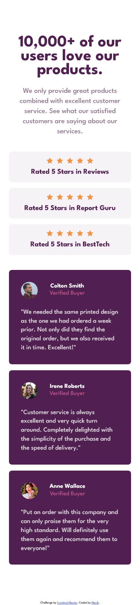
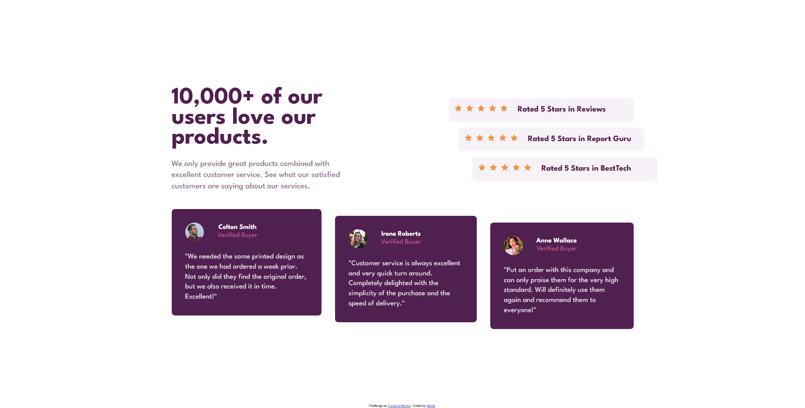

# Frontend Mentor - Social proof section solution

This is a solution to the [Social proof section challenge on Frontend Mentor](https://www.frontendmentor.io/challenges/social-proof-section-6e0qTv_bA). Frontend Mentor challenges help you improve your coding skills by building realistic projects. 

## Table of contents

- [Overview](#overview)
  - [The challenge](#the-challenge)
  - [Screenshot](#screenshot)
  - [Links](#links)
- [My process](#my-process)
  - [Built with](#built-with)
  - [What I learned](#what-i-learned)
  - [Useful resources](#useful-resources)


## Overview

### The challenge

Users should be able to:

- View the optimal layout for the section depending on their device's screen size

### Screenshot

<div style="border: 1px solid black; padding: 10px;">
  <span>
  
  <h1>Mobile</h1>
  </span>
  <span>
  
  <h1>Desktop</h1>
  </span>
</div>

### Links

- Solution URL: [Github](https://github.com/MADITIS/social-proof-section-css-html)
- Live Site URL: [Site](https://social-proof-section-css-html.vercel.app/)

## My process
First start with the simple solution e.g mobile design then started adding complexities.
Setting up the typography and custom properties at the start. 
Not adding specific width to anything. Figuring out what to use flex or grid for the social__info. And write less repeatable css.
### Built with

- Semantic HTML5 markup
- CSS custom properties
- Flexbox
- Mobile-first design
- Reusable styles
- Media Query
### What I learned

- Advance usage of css custom properties
- Make reusable css components
- Write clean css
- Mobile first layout
- Minimal media query

```css
.social {
    --clr-heading:var(--clr-primary-900);
    --clr-text: var(--clr-neutral-600);
    text-align: center;
}

.social__ratings {
    --bg: var(--clr-neutral-400);
    --fg : var(--clr-primary-900);
}


.social__review {
    --bg: var(--clr-primary-900);
    --fg: var(--clr-neutral-100);
    --accent: var(--clr-accent-400);
}
```

### Useful resources

- [BEM Naming](https://getbem.com/naming/) - This helped me making the components more reusable.

